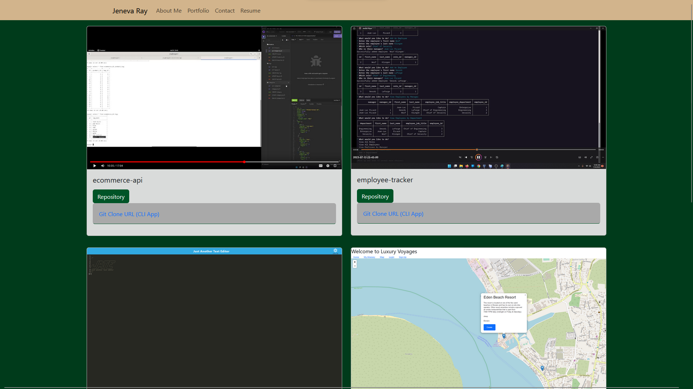

# Portfolio
## Description
React TypeScript Redux Portfolio Showcase using Github API
- I wanted a website to showcase my programming skills and knowledge so that people have an idea of what I can do.
- I built it to learn more of what I don't know!  In the process I got a solid handle on React+TypeScript+Redux, as well as the Github API.
- Why write a portfolio showcase twice, when written well once can be twice as nice?
- I learned React, Redux, TypeScript, and how to take GitHub API data to present my work in a visually dynamic way.

## Table of Contents
- [Installation](#installation)
- [Usage](#usage)
- [Credits](#credits)
- [License](#license)
- [Features](#features)
- [Contribute](#contribute)

## Live Deployment
[Deployment](https://jenevaray.github.io/Portfolio)

## Installation
- `git clone git@github.com:JenevaRay/Portfolio.git`
- `cd Portfolio`
- `npm i(nstall)`
- `npm run start`

## Usage
- Run `npm rum build` to build the production version of the software

## Credits
- I made extensive use of React-Bootstrap, a dynamic and minimal-while-being-extensive templating API.
- I made use of `coolers.co` for color template ideas.
- I used visually appealing CSS code to showcase my work (attributions in comments in-code).
- I used the TypeScript documentation extensively.
## License
[MIT License *file*](LICENSE)

https://opensource.org/licenses/mit
## Features
- Imports data from Github API.
- Visually appealing CSS.
- Advanced templating with React+Redux
- Higher quality code with TypeScript.
## Contributing
Email me at JenevaRay@gmail.com with a Git push request.
## Questions
My GitHub profile: https://github.com/JenevaRay

Please feel free to contact me via Email at JenevaRay@gmail.com